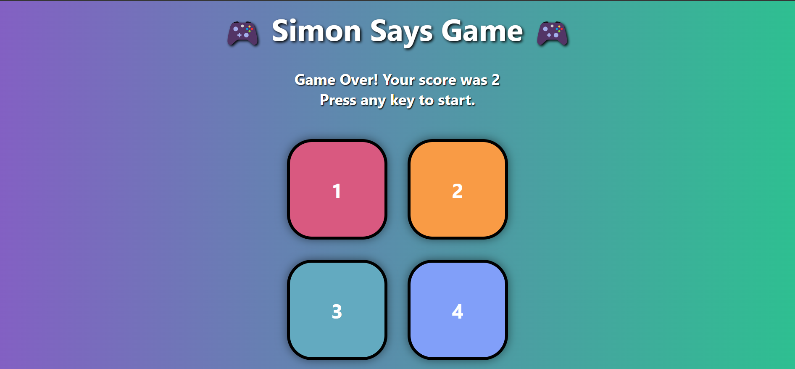
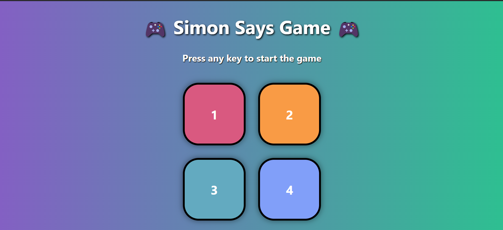

#  Simon Says Game

A fun and interactive memory game inspired by the classic "Simon Says" where players must repeat a sequence of colors that grows longer with each round. Built using **HTML**, **CSS**, and **JavaScript**.

## How to Play

1. Click **Start** to begin the game.
2. Watch the sequence of colors flash.
3. Repeat the sequence by clicking the colored buttons in the correct order.
4. Each successful round adds one more color to the sequence.
5. The game ends if you click the wrong color.

## Technologies Used

- **HTML** – Structure of the game.
- **CSS** – Styling and animations.
- **JavaScript** – Game logic and interactivity.

## 📂 Project Structure

simon-says/
│
├── index.html        # Main HTML file
├── styles.css        # Styling for the game
└── script.js         # Game logic

## 🚀 Features

- Color and sound feedback for each click.
- Increasing difficulty as you progress.
- Game-over animation and reset functionality.
- Responsive design for various screen sizes.

## 🎨 Preview

 

## 📸 Screenshots

## 💡 Future Improvements

- Add difficulty levels.
- Add high score tracking.
- Add sound mute/unmute option.
- Improve mobile responsiveness.

## 🧑‍💻 Author

**Drishti Porwal**  
